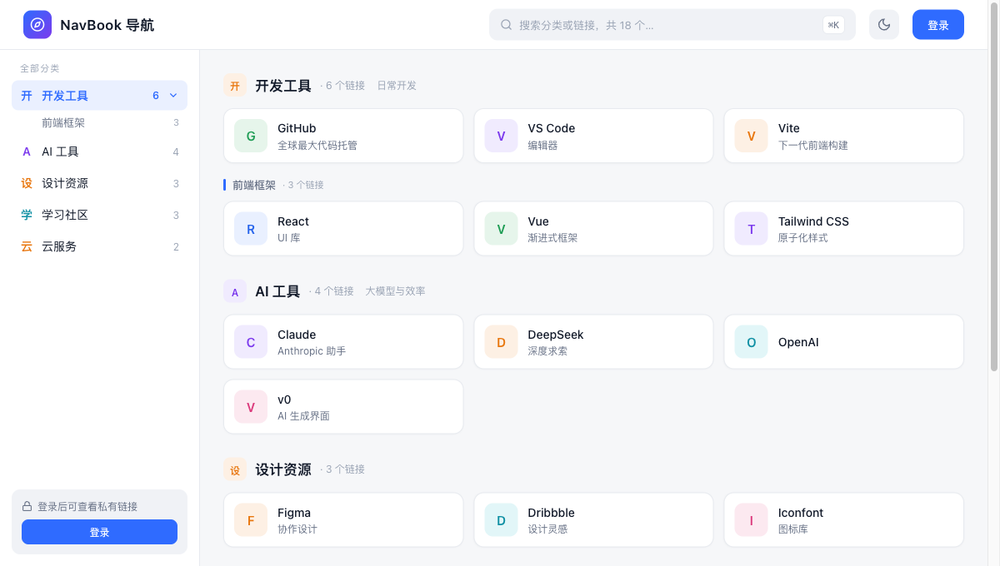
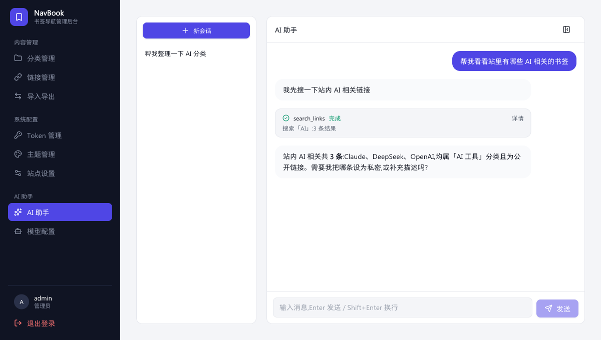
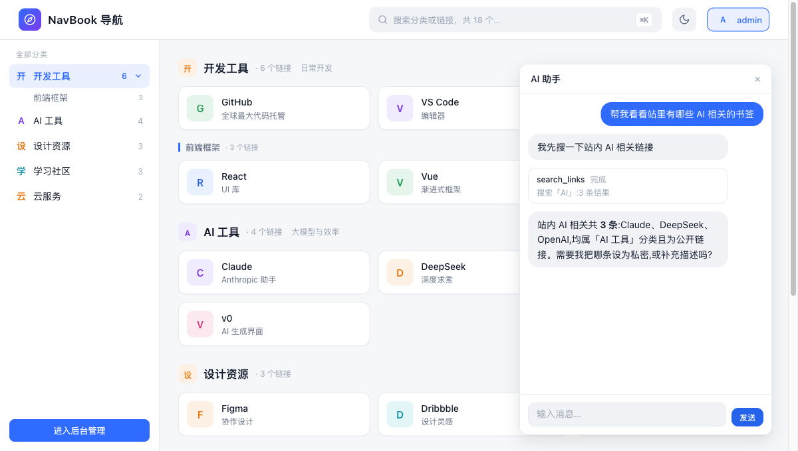

# NavBook

跑在 Cloudflare Workers 上的书签导航站 + AI 管理助手。单用户自部署:一个 D1 数据库、一个 Worker,免费额度内即可运行。API 兼容 OneNav 浏览器插件(X-Token)与 `onenav.bookmarks` 导入导出格式(PHP 原版互通)。



## 功能

**书签导航**
- 两级分类 + 链接管理,公开/私密属性,关键字搜索与筛选,点击统计
- 多主题(卡片网格 compass / 紧凑列表 minima),后台一键切换;主题是独立 SPA,复制目录即可开发新主题
- 隐私模式:游客连首页都不可见(302 登录)

**AI 助手(管理端全功能,主题页登录态气泡同款)**
- OpenAI 兼容多厂商(DeepSeek/通义/Kimi/智谱/豆包/OpenAI/Claude/Gemini/自定义),预设一键填充,Key 打码回显
- **ReAct 工具调用**:13 个内置工具直连站内数据——搜索/分类/详情/点击统计/站点设置/网页抓取(fetch_url,HTMLRewriter 提取正文)/增删改链接与分类/记忆更新;工具卡交错嵌在聊天流中,spinner + 计时
- **统一批量协议**:`batch_read`(≤10 项并发)/ `batch_write`(≤20 项聚合一张确认卡),action 枚举按当前工具集动态生成,新工具零代码自动可嵌
- **执行策略**:`toolPolicy` 按工具覆盖确认行为(如把 fetch_url 设为"需确认"),配置 > MCP trust > 工具默认,单一决策点收口
- **写操作人工确认**:确认卡(后端生成操作摘要),确认/取消后恢复对话;pending 卡阻塞新消息(Claude 权限提示式串行)
- **远程 MCP**(Streamable HTTP):后台可配 ≤5 个服务器,工具自动发现(缓存 10 分钟)并入 agent,联网搜索/读网页即插即用
- **长期记忆**:单文档(≤4000 字符)每轮注入 system prompt,模型经 `memory_write` 自维护;升级路径预留 CF Agent Memory
- **思考流**(reasoning_content)折叠展示,Markdown 渲染



**后台回合(Durable Object)**
- 聊天回合在会话专属 DO 内运行:**关闭页面继续生成**,重开自动重挂续流(事件流重放,无轮询);多会话物理隔离
- 渐进落库(2s 节流)+ 断点标记 + alarm 崩溃自愈;服务端停止按钮;空闲零计费(免费额度内)



## 结构

```
workers/  API + DO(Hono + D1/Drizzle + AgentTurnDO),并把首页路由到当前主题
          └ src/ai/:agent(编排)/provider(厂商流式)/tools(注册表)/batch(批量+策略)
             /context(上下文组装)/mcp/conversations/memory/fetcher
web/      管理后台 SPA(/admin):分类/链接/导入导出/Token/主题/站点设置/模型配置/AI 助手
themes/   独立主题项目(compass/minima),产物即分发单元
shared/   契约包(@navbook/shared):API client + SSE 解析 + 聊天状态机(两端共用)
```

设计文档与实施计划在 `docs/superpowers/`(spec/plan 成对,含全部架构决策记录)。

## 开发

```bash
pnpm install
pnpm -C workers db:migrate:local    # 首次:建本地 D1(可加 --local 演示数据)
pnpm dev                            # workers(8787)+ web(5173)
pnpm --filter @navbook/theme-compass dev   # 单主题热更
pnpm test                           # workers 265 测试(真实 D1 + 真实 DO)
pnpm --filter @navbook/shared test  # 状态机/协议测试
```

本地首次访问 `http://localhost:8787/admin` 走初始化流程设置管理员密码。

## 部署

```bash
pnpm deploy   # 构建全部包 → 聚合到 workers/dist → wrangler deploy
```

首次部署需:`wrangler d1 create navbook` + `pnpm -C workers db:migrate:remote` + wrangler.toml 配 database_id 与 routes(自定义域名)。Durable Object 随首次 deploy 自动创建(SQLite-backed,免费计划可用)。

## 数据迁移

从旧 OneNav(PHP)导出 JSON → 后台「导入导出」页导入(格式 `onenav.bookmarks` 互通;同名分类合并、重复 URL 跳过)。

## 兼容契约(勿动)

- 导入导出格式 `onenav.bookmarks`(PHP/ZMark 互通)
- 浏览器插件:`X-Token = md5(用户名 + SecretKey)`、`app_info` 的 `onenav_version`(插件判版本区间)
- 兼容错误文案与 `/index.php?c=api&method=` 转发
